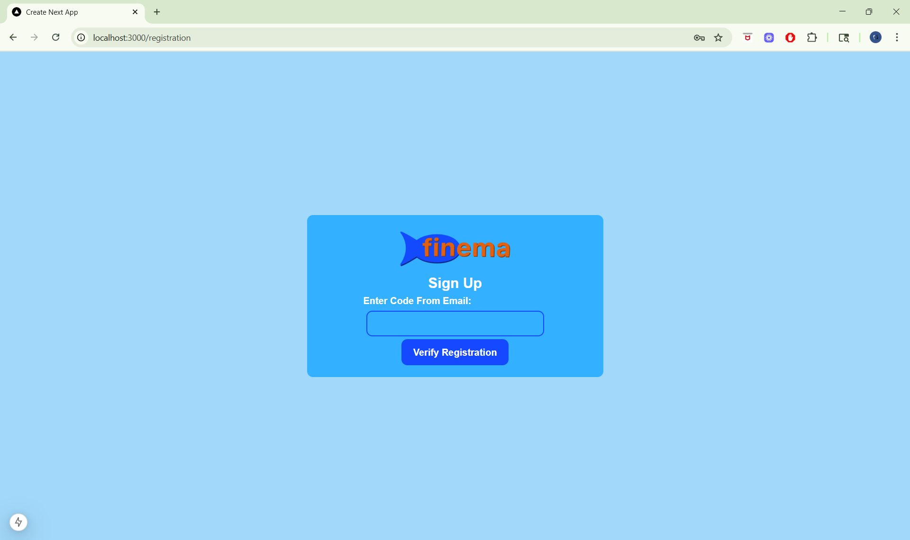

# Finema
Finema is an online cinema e-booking system that allows users to create an account, browse movies and showtimes, and securely reserve tickets. 

## Admin Features
- Add movies with several details such as title, category, synopsis, cast & crew, trailer picture & video, MPAA-US film rating code, & ticket prices for each ticket type.
- Schedule movie showtimes with a date and showroom.
- Manage user accounts by suspending, unsuspending, making into an administrator, or removing administrator status.
- Add promotions with a specified duration.

## User Features
- Secure acount signup with verification code sent to user's email.
- Write & view movie reviews.
- Select a movie showtime, specify the number of tickets needed for child, adult, or senior viewers, & the seating arrangement for each.
- Pay for order using new or saved credit card information & possibly apply a promotion code for a discount.
- View order history with ability to return tickets.
- Edit profile information.
- Save credit cards with sensitive information encrypted in the database using BCrypt.

## General Features
- Secure role-based JWT-based authentication. 
- Secure password reset functionality with a unqiue link made with a token sent to user's email.
- Browse movies & showtimes.
- Account passwords are encrypted in the database for security using BCrypt.

## Screenshots
<a href="images/landing_page.png">
  
</a>
<a href="images/account_sign_up.png">
  
</a>
<a href="images/account_sign_up_card.png">
  
</a>
<a href="images/account_verify.png">
  
</a>
<a href="images/database_encryption.png">
  
</a>
<a href="images/movie_search.png">
  
</a>
<a href="images/movie_search_filter.png">
  
</a>
<a href="images/reset_password.png">
  
</a>
<a href="images/reset_password_token.png">
  
</a>

### Admin
<a href="images/admin_login.png">
  
</a>
<a href="images/admin_landing_page.png">
  
</a>
<a href="images/admin_add_movie.png">
  
</a>
<a href="images/admin_select_date.png">
  
</a>
<a href="images/admin_select_showroom.png">
  
</a>
<a href="images/admin_select_movie.png">
  
</a>
<a href="images/admin_manage_users.png">
  
</a>
<a href="images/admin_add_promo.png">
  
</a>

### User
<a href="images/user_select_movie.png">
  
</a>
<a href="images/user_book_tickets.png">
  
</a>
<a href="images/user_select_time_tickets.png">
  
</a>
<a href="images/user_select_seats.png">
  
</a>
<a href="images/user_order_summ.png">
  
</a>
<a href="images/user_order_booked.png">
  
</a>
<a href="images/user_order_history.png">
  
</a>
<a href="images/user_manage_profile.png">
  
</a>
<a href="images/user_saved_cards.png">
  
</a>

### Email
<a href="images/email_account_verif_code.png">
  
</a>
<a href="images/email_reset_passw.png">
  
</a>
<a href="images/email_promo.png">
  
</a>

## Prerequisites
1. Ensure the latest version of Java is installed.
2. Download maven if it is not already on the system in order to compile and run the backend code.
3. Install NPM packages. `npm install`

## Setup
1. Create a database on MySQL called "finema_db".
2. Clone or fork this repository
3. To compile the backend:
```bash 
mvn clean install -U
```
4. To run the backend
```bash 
mvn spring-boot:run
```
5. To run the frontend:
```bash 
npm run dev
```

## Technologies Used
- Version Control: GitHub
#### Backend
- Language: Java 22.0.2
- Framework: Spring Boot
- Build Tool: Maven
- Authentication: JWT - JSON Web Token
- Security: Spring Security
- Database: MySQL
#### Frontend
- Language: JavaScript/TypeScript
- Framework: React.js
- Styling: Tailwind CSS
- Routing: React Router

## Contribution
This project was made through the collaborative effort of 4 people.
- Nehaa Umapathy led the team, organized the database architecture, and implmented several backend functionalities such as secure role-based authentication, sensitive data encyrption, and email verification.
- Max Allgaier implemented the backend functionality for movie search with filters, user reviews, promotional offers, and profile editting.
- Joshua Konfrst implemented the frontend functionalities for the user side interface including the user authentication, movie browsing, and ticket booking flow.
- Mudgie Hermann designed and implemented the user interface layout and developed the frontend functionalities for the admin side interface.
